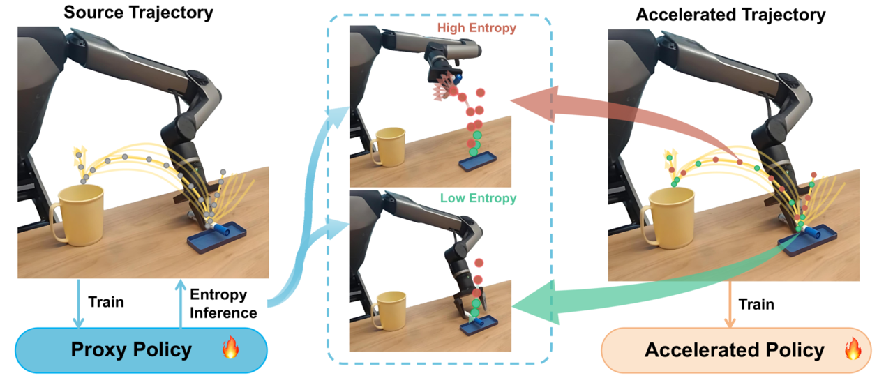

# [DemoSpeedup⚡: Accelerating Visuomotor Policies via Entropy-Guided Demonstration Acceleration ](https://demospeedup.github.io/)
[[Project website](https://demospeedup.github.io/)] [[Paper](https://arxiv.org/html/2506.05064v1)]

**CoRL 2025 <span style="color:red">(oral)</span>**



This repo contains the official implementation of DemoSpeedup:a self-supervised method to accelerate visuomotor policy execution via entropy-guided demonstration acceleration.  This repo achieves instantiations of combining DemoSpeedup with two popular imitation learning methods, [Diffusion Policy](https://arxiv.org/abs/2303.04137) and [Action Chunking with Transformers (ACT)](https://arxiv.org/abs/2304.13705), and the respective benchmarking environments, [Aloha](https://github.com/lucys0/awe) and [Bigym](https://chernyadev.github.io/bigym/).


## Installation
1. Clone this repository
```bash
git clone git@github.com:lingxiao-guo/DemoSpeedup.git
cd demospeedup
```

2. Install MuJoCo 2.1
* Download the MuJoCo version 2.1 binaries for [Linux](https://mujoco.org/download/mujoco210-linux-x86_64.tar.gz).
* Extract the downloaded `mujoco210` directory into `~/.mujoco/mujoco210`.

3. Refer to  **Aloha Simulation Suite** and **Bigym Simulation Suite** to set up each corresponding environment.


## Aloha Simulation Suite
### Set up the environment
```bash
conda env update -f act/conda_env.yaml
cd aloha && pip install -r requirements.txt 
```

### Download data
Please download scripted/human demo for simulated environments from [here](https://drive.google.com/drive/folders/1gPR03v05S1xiInoVJn7G7VJ9pDCnxq9O) and save them in `data/`.


### Usage
Please replace `[TASK]` with your desired task to train, `[TASK]={ sim_transfer_cube_human, sim_insertion_human}`; Replace `[ALGO]` with your desired algorithm, `[ALGO]={ACT, DP}`; Replace `[Batch_Size]` with corresponding number, where we recommend `[Batch_Size]=8` for ACT and `[Batch_Size]=40` for DP; Use `[Chunk_Size]=50` for ACT and `[Chunk_Size]=48` for DP.


### Train proxy policy
```bash
cd demospeedup/act && conda activate aloha
python act/imitate_episodes.py --task_name [TASK] --ckpt_dir data/outputs/[ALGO]_ckpt/[TASK] --policy_class [ALGO] --kl_weight 10 --chunk_size [Chunk_Size] --hidden_dim 512 --batch_size [Batch_Size] --dim_feedforward 3200 --num_epochs 16000 --lr 1e-5 --seed 0 --temporal_agg 
```
### Use proxy policy to label demo entropy 
```bash
python act/imitate_episodes.py --task_name [TASK] --ckpt_dir data/outputs/[ALGO]_ckpt/[TASK] --policy_class [ALGO] --kl_weight 10 --chunk_size [Chunk_Size] --hidden_dim 512 --batch_size [Batch_Size] --dim_feedforward 3200 --num_epochs 16000 --lr 1e-5 --seed 0 --temporal_agg  --label
```
### train policy on accelerated demos
```bash
python act/imitate_episodes.py --task_name [TASK] --ckpt_dir data/outputs/[ALGO]_ckpt/[TASK] --policy_class [ALGO] --kl_weight 10 --chunk_size [Chunk_Size] --hidden_dim 512 --batch_size [Batch_Size] --dim_feedforward 3200 --num_epochs 16000 --lr 1e-5 --seed 0 --temporal_agg   --speedup
```
### eval accelerated policy 
During evaluation, we recommend to adopt `--temporal_agg` for ACT and discard it for DP.
```bash
python act/imitate_episodes.py --task_name [TASK] --ckpt_dir data/outputs/[ALGO]_ckpt/[TASK] --policy_class [ALGO] --kl_weight 10 --chunk_size [Chunk_Size] --hidden_dim 512 --batch_size [Batch_Size] --dim_feedforward 3200 --num_epochs 16000 --lr 1e-5 --seed 0 --temporal_agg  --speedup --eval
```


## Bigym Simulation Suite

## Install

System installs:

```bash
sudo apt-get install ffmpeg  # Usually pre-installed on most systems
```

```bash
cd robobase && pip install .
cd third_party/bigym && pip install -e .
cd ../demonstrations && pip install -e .
```

### Usage
Use `dp_pixel_bigym` to train Diffusion Policy and `act_pixel_bigym` to train ACT. For example:

### Train proxy policy
```bash
cd demospeedup/robobase && conda activate robobase
python3 train.py launch=dp_pixel_bigym env=bigym/sandwich_remove
```

### Use proxy policy to label demo entropy 
```bash
python3 label.py launch=dp_pixel_bigym env=bigym/sandwich_remove 
```

### train policy on accelerated demos
```bash
python3 train.py launch=dp_pixel_bigym env=bigym/sandwich_remove speedup=True 
```

 
See the full list of task names in `robobase/robobase/cfgs/env/bigym`. The evaluation results are saved in  `robobase/exp_local`.

If you encountered any issue, feel free to contact lingxiag@andrew.cmu.edu.

